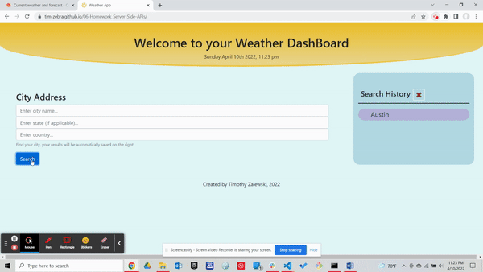
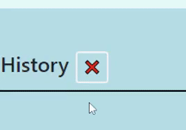

# What's my Weather?
UT Bootcamp Homework #6 - Weather Dashboard

## Description:
A pleasant weather dashboard that can be used to check the weather of a current city, as well as obtain a 5 day forecast. 

## How to Use:
Enter in the city name.  
(If you are able to also enter in the State and/or Country that will help increase the accuracy of your results)  
Click "Search" or press Enter.  
You may also click on your previous results to view a particular city again.

## Website Visual Demo:
  
  
Link to full demo: https://drive.google.com/file/d/11SKNRHLyEEJyvUtkaRQ48qDNy2cJyWiv/view

## Link to Deployed Page:
https://tim-zebra.github.io/06-Homework_Server-Side-APIs/

## References:
Obtained favicon images from: https://www.freeiconspng.com  
Bootstrap form obtained from: https://getbootstrap.com/docs/4.0/components/forms/  
Obtained local storage and moment JS from my 05 Homework: https://github.com/Tim-Zebra/05-Homework_Third-Party-APIs

## Development Process (See commits for more details):
Wireframed page + Pseudocode  
HTML layout based on criteria  
JS function and testing with HMTL  
CSS added to enhance user experience